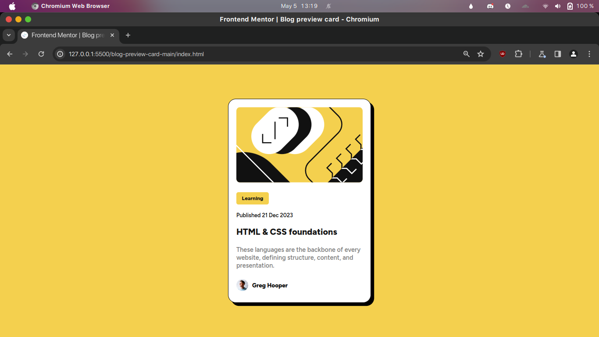
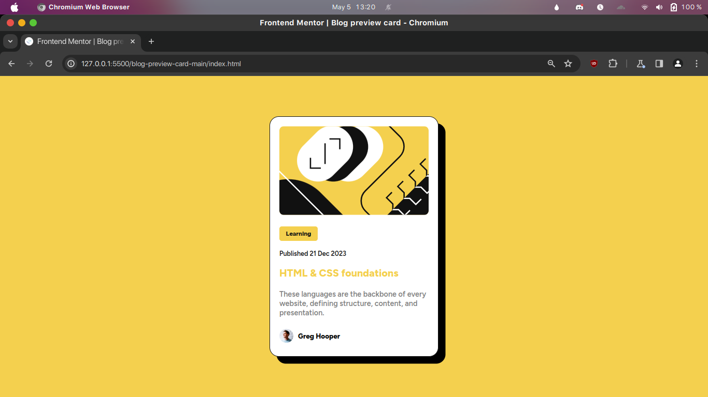

# Frontend Mentor - Blog preview card solution

This is a solution to the [Blog preview card challenge on Frontend Mentor](https://www.frontendmentor.io/challenges/blog-preview-card-ckPaj01IcS). Frontend Mentor challenges helped me improve my coding skills by building realistic projects. 

## Table of contents

- [Overview](#overview)
  - [The challenge](#the-challenge)
  - [Screenshot](#screenshot)
  - [Links](#links)
- [My process](#my-process)
  - [Built with](#built-with)
  - [What I learned](#what-i-learned)
- [Author](#author)


## Overview

### The challenge

Users should be able to:

- See hover and focus states for all interactive elements on the page

### Screenshot

- Desktop Layout



- Active State



### Links

- Solution URL: [blog-review-card-main (GitHub)](https://github.com/Shubhojit-Mitra/blog-preview-card-main.git)
- Live Site URL: [blog-review-card-main (Github Pages)](https://shubhojit-mitra.github.io/blog-review-card-main)

## My process

### Built with

- Semantic HTML5 markup
- CSS custom properties
- Flexbox


### What I learned

I learned about how to import local fonts and how to how to use var() in CSS

```css
:root {
    --Yellow: hsl(47, 88%, 63%);
    --White: hsl(0, 0%, 100%);
    --Grey: hsl(0, 0%, 50%);
    --Black: hsl(0, 0%, 7%);
}

@font-face {
    font-family: myFontRegular;
    src: url("./assets/fonts/static/Figtree-SemiBold.ttf");
}

@font-face {
    font-family: myFontBold;
    src: url("./assets/fonts/static/Figtree-ExtraBold.ttf");
}
```


## Author

- LinkedIn - [Shubhojit Mitra](https://linkedin.com/in/shubhojit-mitra-dev)
- Frontend Mentor - [@shubhojit-mitra](https://www.frontendmentor.io/profile/shubhoit-mitra)


